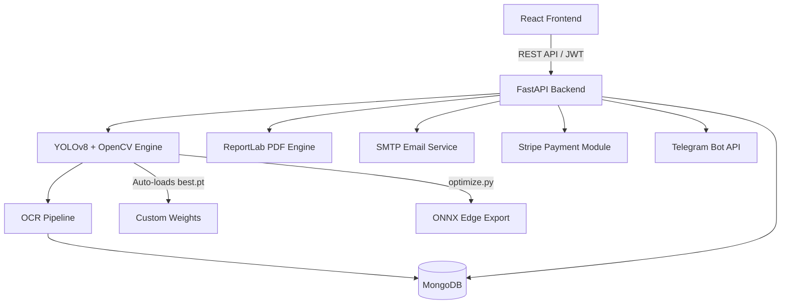

# 🚦 AI-Powered Smart Traffic Management System

> Intelligent Traffic Monitoring using Computer Vision, OCR, Custom YOLOv8 Fine-Tuning, and Traffic Forecasting.

[]()
[]()
[]()
[]()
[]()
[]()
[]()

## 📌 Overview

This project is an AI-powered Smart Traffic Management System that automates urban traffic monitoring using Computer Vision and Deep Learning. 

The system tracks vehicles, flags speeding, wrong lane usage, wrong direction driving, and helmet compliance. Validated offenses trigger OCR license plate extraction, retrieve driver profiles, generate PDF invoices, and send automated notifications via Telegram and Email.

---

## ✨ Key Features

- **🚗 AI Vehicle Detection & Tracking**: Custom tracking engine for cars, bikes, buses, trucks, and autos.
- **🚥 Traffic Violation Auditing**: Speed monitoring, red-light line tracking, wrong lane driving, wrong direction vector detection, and helmet safety.
- **🔤 ANPR EasyOCR Pipeline**: License plate text extraction with composite evidence screenshots.
- **🎯 Custom YOLOv8 Fine-Tuning**: A dedicated training module to fine-tune weights on local datasets.
- **⚙️ ONNX Edge Deployment**: Optimization pipeline compiling trained PyTorch weights to ONNX files for NVIDIA Jetson Nano / Raspberry Pi processors.
- **💬 Telegram Bot alerts**: Instant dispatch of e-challans containing plate number, violation type, fine, timestamp, payment URL, and evidence photo.
- **📈 Double Exponential Smoothing Forecast**: Holt's linear trend forecast projecting hourly violation patterns.
- **📊 Analytics Dashboard**: Charts.js visualizer charting daily, weekly, and monthly trends.
- **🗺️ Leaflet GIS Mapping**: Interactive geographic mapping of camera nodes and logs.
- **🔐 JWT Authentication & RBAC**: Secure admin, operator, and viewer roles.
- **💳 Payment Sandbox**: Complete Stripe checkout simulation.

---

## 🛠️ Tech Stack

| Layer | Technology |
|---|---|
| **Frontend** | React.js (Material UI, Leaflet, Chart.js) |
| **Backend** | FastAPI (Uvicorn, Pydantic) |
| **Database** | MongoDB (PyMongo / Motor) |
| **AI / Vision** | YOLOv8 (Ultralytics), OpenCV, EasyOCR, PyTorch |
| **Integrations** | Telegram Bot HTTP API, SMTP Email, Stripe Checkout |

---

## 🏛 System Architecture



---

## 📂 Project Structure

```text
smart-traffic-management/
├── backend/
│   ├── config/         # Environment & Database settings
│   ├── database/       # Seeder & connection handlers
│   ├── middleware/     # Auth & CORS Middleware
│   ├── models/         # Pydantic & MongoDB Schemas
│   ├── routes/         # API Endpoint controllers
│   ├── scripts/        # Model optimization utilities
│   ├── services/       # AI, Telegram, Email & PDF services
│   ├── tests/          # Pytest suite
│   ├── training/       # YOLOv8 custom training scripts
│   ├── main.py         # App launcher
│   └── yolov8n.pt      # Model weights
├── docs/               # System & Edge deployment documentation
├── frontend/           # React dashboard SPA
├── docker-compose.yml
└── README.md
```

---

## 🚀 Running the Custom Training & ONNX Export

### 1. Custom YOLOv8 Fine-Tuning
Execute the custom training script inside the backend virtual environment:

```bash
cd backend
python -m venv venv
# Activate virtualenv (Windows)
.\venv\Scripts\activate
# Run training script
python training/train_yolo.py --epochs 5 --batch 4 --lr 0.01 --optimizer AdamW
```
This trains the model, saves the best weights to `backend/weights/best.pt`, and saves the evaluation report.

### 2. Export Model to ONNX
Export your trained model for edge hardware compilation:

```bash
python training/export_model.py
```
This saves `best.onnx` inside `backend/weights/`. Refer to `docs/EDGE_DEPLOYMENT.md` for Jetson Nano/Raspberry Pi deployment steps.

---

## 🐳 Run with Docker (Recommended)

Start all services with a single command:

```bash
docker-compose up --build -d
```

Stop the services:

```bash
docker-compose down
```

---

## 📄 License

This project is developed for educational and research purposes.

## 👨‍💻 Author

**Manish Kumar**  
B.Tech CSE  
Artificial Intelligence • Computer Vision • Full Stack Development  

GitHub: [@Manishkumar1163](https://github.com/Manishkumar1163)