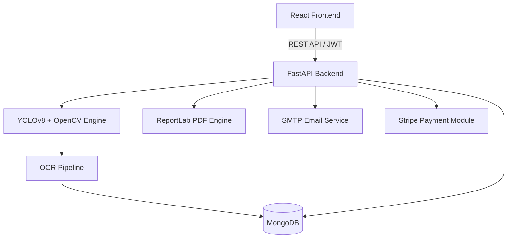

# 🚦 AI-Powered Smart Traffic Management System

> Intelligent Traffic Monitoring using Computer Vision, OCR, and Artificial Intelligence.

[]()
[]()
[]()
[]()
[]()
[]()
[]()

## 📌 Overview

This project is an AI-powered Smart Traffic Management System that automates traffic monitoring using Computer Vision and Artificial Intelligence.

The system detects vehicles, recognizes number plates, identifies traffic violations, generates digital challans, and provides real-time analytics through a modern dashboard.

Designed as a scalable full-stack solution, it demonstrates how AI can enhance urban traffic management and support smart city initiatives.

## ✨ Features

- 🚗 Real-time Vehicle Detection
- 🚥 Traffic Violation Detection
- 🔤 Automatic Number Plate Recognition (ANPR)
- 📄 Digital Challan Generation
- 📧 Email Notifications
- 📊 Analytics Dashboard
- 🗺 Interactive GIS Map
- 🔐 JWT Authentication
- 💳 Online Fine Payment
- 📈 PDF & Excel Reports

## 🛠️ Tech Stack

| Layer | Technology |
|--------|------------|
| Frontend | React.js |
| Backend | FastAPI |
| Database | MongoDB |
| AI | YOLOv8 |
| OCR | EasyOCR |
| Vision | OpenCV |
| Authentication | JWT |
| Maps | Leaflet |
| Charts | Chart.js |

## 🏛 System Architecture


## 🚀 Project Highlights

- ⚡ Real-time AI-based vehicle detection using **YOLOv8**
- 🚗 Automatic Number Plate Recognition (ANPR) with **EasyOCR**
- 📄 Automatic Digital Challan Generation
- 📊 Interactive Analytics Dashboard with Charts
- 🗺️ GIS-based Traffic Monitoring using Leaflet
- 🔐 Secure JWT Authentication & Role-Based Access
- 📧 Automated Email Notifications
- 💳 Online Fine Payment Integration
- 📈 PDF & Excel Report Generation
- 🐳 Docker Support for Easy Deployment

## 📂 Project Structure

```text
smart-traffic-management/
├── backend/
│   ├── config/         # App & DB Configs
│   ├── middleware/     # Auth & CORS Middleware
│   ├── models/         # Pydantic & Mongo Models
│   ├── routes/         # REST API Endpoints
│   ├── services/       # AI, OCR, PDF & Email logic
│   ├── tests/          # Pytest suite
│   ├── main.py         # Entry point
│   └── requirements.txt
├── frontend/
│   ├── src/
│   │   ├── components/ # Reusable UI Modules
│   │   ├── pages/      # Dashboard, Map, Violations
│   │   └── services/   # API Integration
├── docker-compose.yml
└── README.md
```
## 🐳 Run with Docker (Recommended)

Start all services with a single command:

```bash
docker-compose up --build -d
```

Stop the services:

```bash
docker-compose down
```

## ⚙️ Installation

### Clone the Repository

```bash
git clone https://github.com/Manishkumar1163/smart-traffic-management.git
cd smart-traffic-management
```

### Backend Setup

```bash
cd backend
python -m venv venv

# Windows
venv\Scripts\activate

# Linux/macOS
source venv/bin/activate

pip install -r requirements.txt
python main.py
```

### Frontend Setup

```bash
cd ../frontend
npm install
npm start
```

## 📄 License

This project is developed for educational and research purposes.

## 👨‍💻 Author

**Manish Kumar**

B.Tech CSE

Artificial Intelligence • Computer Vision • Full Stack Development

GitHub: [@Manishkumar1163](https://github.com/Manishkumar1163)

## ⭐ Support

If you found this project useful, please consider giving it a ⭐ on GitHub.