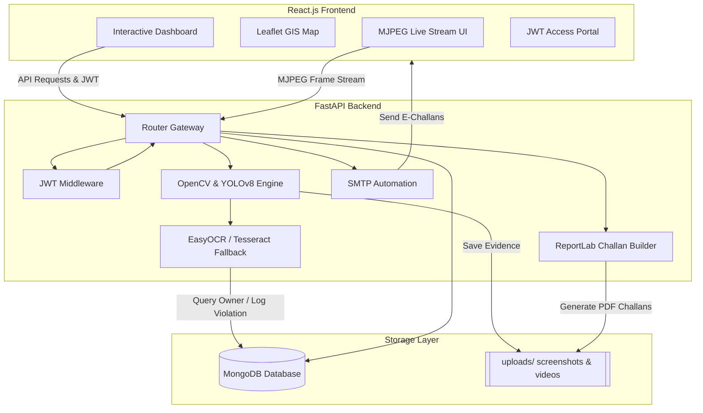

# 🚦 Smart Traffic Management System

A production-grade, AI-powered system designed for automated traffic violation detection, real-time camera monitoring, license plate recognition (OCR), and automated challan generation and settlement. Designed to serve as a complete B.Tech Final Year Major Project and a high-quality portfolio item.

---

## 🏗️ System Architecture

The project is designed using a clean, decoupled full-stack architecture featuring a React.js client interface, a FastAPI REST core, and a MongoDB document store. Below is the system flow and architectural layout.



---

## 📂 Project Directory Structure

The system has been restructured into a modular, production-ready directory layout:

```text
smart-traffic-management/
├── backend/
│   ├── config/             # App configurations, environment loaders (settings.py)
│   ├── database/           # MongoDB Client and database connection pool (connection.py)
│   ├── middleware/         # JWT Authentication and Role-Based Access Control (auth.py)
│   ├── models/             # Pydantic Schemas for validation and API inputs (schemas.py)
│   ├── routes/             # FastAPI Endpoint Routers (auth.py, violations.py, live.py, etc.)
│   ├── services/           # Business Logic: CV processing, OCR, Email, ReportLab (cv.py, pdf.py)
│   ├── utils/              # Helper utilities: security, password hashing (security.py)
│   ├── uploads/            # Video uploads and screenshot storage
│   ├── reports/            # Generated PDF Challans and Reports
│   └── main.py             # FastAPI App Entrypoint
├── frontend/
│   ├── components/         # Reusable presentation components
│   ├── context/            # React AuthContext, ThemeContext
│   ├── pages/              # Page components (Dashboard, LiveCamera, Violations, Login, MapView)
│   ├── App.js              # Application routing & layout assembly
│   ├── index.js            # Frontend DOM mount
│   └── package.json        # Frontend NPM configurations
├── docs/                   # Academic reports, ER diagrams, project guides
└── README.md               # Main project documentation
```

---

## 🧠 AI & Computer Vision Logic

The system utilizes a custom pipeline combining **YOLOv8** for object detection and **OpenCV** for spatial-temporal logic tracking:

1. **Helmet Detection:**
   - Detects `person` and `motorcycle` classes.
   - Restricts riders to a narrow spatial crop relative to the bike center-x.
   - Crops the top 30% of the passenger's bounding box (head region).
   - Computes skin color HSV thresholds. If the skin ratio is high, it flags **No Helmet**.

2. **Seat Belt Detection:**
   - Detects the vehicle driver/passenger region.
   - Extracts the torso area and runs a Hough Line Transform to detect diagonal lines matching seatbelt angles ($30^\circ$ to $70^\circ$).
   - Creates a composite zoomed crop of the driver for administrative proof.

3. **Traffic Signal Violation:**
   - Monitors a defined Stop Line ($Y$-coordinate).
   - Dynamically scans the upper frame quadrant for active red signal bulbs.
   - If a vehicle crosses the stop line coordinate while the signal is **Red**, a violation is triggered.

4. **Over-speeding Detection:**
   - Tracks centroid pixel movement over successive frames.
   - Converts pixels traversed per frame into real-world speed ($\text{km/h}$) using camera perspective calibrations.

---

## 🗄️ Database Model (ER Diagram Description)

The system uses three core collections inside MongoDB:
- **`users`**: Contains system operator credentials, names, emails, hashed passwords, and roles (`admin`, `traffic_officer`, `viewer`).
- **`violations`**: Holds violation records, including license plate numbers, violation types, fine amount, time, status (`pending`, `paid`), screenshot location, and payment timestamps.
- **`videos`**: Logs processed video uploads, file paths, locations, and the number of detections captured.

---

## ⚡ Setup & Installation

### Backend Prerequisites
- **Python 3.10+**
- **MongoDB** running locally on `localhost:27017`
- **Tesseract OCR** installed on your OS (and path configured in environment if required)

### Execution Steps
1. Navigate to the backend directory:
   ```bash
   cd backend
   ```
2. Create and activate a virtual environment:
   ```bash
   python -m venv venv
   .\venv\Scripts\Activate.ps1
   ```
3. Install the dependencies:
   ```bash
   pip install -r requirements.txt
   ```
4. Start the backend server:
   ```bash
   python main.py
   ```

### Frontend Execution
1. Navigate to the frontend directory:
   ```bash
   cd ../frontend
   ```
2. Install npm dependencies:
   ```bash
   npm install
   ```
3. Run the development server:
   ```bash
   npm start
   ```
