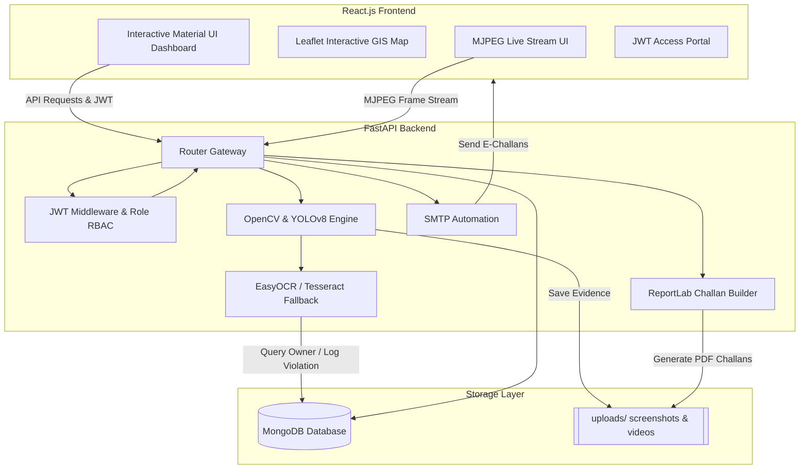
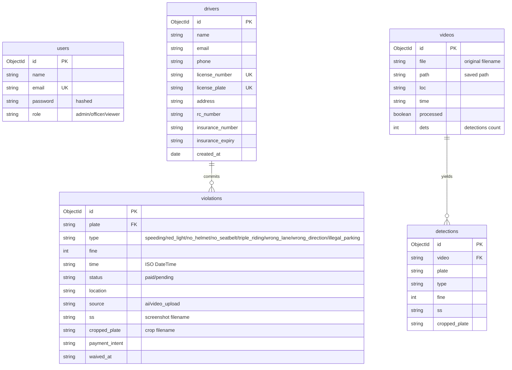

# Academic Project Report: AI-Powered Smart Traffic Management System

**Program**: Bachelor of Technology (B.Tech) - Final Year Major Project  
**Author**: Manish Kumar  
**Domain**: Computer Vision, Artificial Intelligence, Full-Stack Software Engineering

---

## 1. Executive Summary
The **Smart Traffic Management AI System** is a production-quality, decentralized software platform designed to automate traffic enforcement. By combining state-of-the-art deep learning object detection (YOLOv8) with heuristics-based computer vision (OpenCV) and optical character recognition (EasyOCR/Tesseract), the system monitors road junctions, records traffic infractions, maps license plates to registered driver profiles, and issues digital penalizations (challans) automated via email notifications and online card payments (Stripe).

---

## 2. System Architecture & Component Design
The system utilizes a decoupled microservices architecture composed of a React client interface, a Python FastAPI core, and a MongoDB database.

### Decoupled Subsystems
1. **Frontend Client**: Built on React.js, compiled using Material UI elements, styled with premium dark modes, and integrated with Leaflet maps.
2. **REST Web Core**: Powered by FastAPI, featuring standard asynchronous request handlers, rate-limiting, CORS validation, and dependency-injected JWT authentication.
3. **AI Pipeline**: Implements YOLOv8 deep learning alongside custom OpenCV spatial vectors, running as concurrent threads or background worker queues.
4. **NoSQL Store**: MongoDB documents manage operators, violations, videos, detections, and driver profiles.

---

## 3. Database Entity-Relationship (ER) Schema
The data store runs inside MongoDB using five decoupled collections linked by plate identifiers and video reference keys.

---

## 4. Deep Learning & Computer Vision Algorithms
The core CV logic is executed by `backend/services/cv.py`.

### 4.1 Speed Detection
Vehicle centroids are tracked across multiple frames. Velocity is calculated as:
\[\text{Speed} = \frac{\Delta d}{\Delta t} \times \text{Calibration Factor}\]
Where \(\Delta d\) represents pixel distance traveled, and \(\Delta t\) is time elapsed. If the calculated value exceeds `settings.MAX_SPEED` (default 60 km/h), a ticket is triggered.

### 4.2 Red Light Violation
- An active stop-line is defined on the y-axis coordinate (`settings.STOP_Y`).
- The upper portion of the frame is analyzed using HSV color thresholding to detect if the traffic light is emitting a Red signal.
- If a vehicle track's centroid coordinate crosses the stop line from top to bottom while the signal is active, a violation is recorded.

### 4.3 Helmet Compliance
- Restricts the passenger check region by extracting bounding boxes of riders relative to `motorcycle` centroids.
- Crops the top 30% area of the rider's bounding box (representing the head region).
- Converts the head crop to YCrCb space and filters skin-colored pixels. If skin ratio exceeds 38%, it indicates a bare head, logging a **No Helmet** violation.

### 4.4 Seat Belt Violation
- Torso regions are cropped from car passengers.
- A Canny Edge filter is run to isolate contours.
- A Hough Line Transform detects straight line segments. Angle thresholds between \(30^\circ\) and \(70^\circ\) are validated. If no matching diagonal lines are found, it triggers a **No Seatbelt** ticket.

### 4.5 Wrong Lane / Oncoming Direction
- Checks the vehicle's center `cx` against junction lane boundaries (e.g. \(cx > \text{width} \times 0.78\) indicates crossing the lane separator).
- Tracks vector travel: if \(\Delta y < -40\) (meaning the vehicle is driving upwards against the downward traffic flow direction), a **Wrong Direction** violation is triggered.

### 4.6 Illegal Parking
- Tracks stationary vehicles in restricted shoulders (e.g., \(cx < \text{width} \times 0.22\)).
- If a vehicle track's centroid variance is near zero for more than 60 consecutive frames, it logs an **Illegal Parking** ticket.

---

## 5. Optical Character Recognition (OCR) Pipeline
The system utilizes a multi-step OCR pipeline inside `backend/services/ocr.py` to extract text from vehicle registration plates:

1. **Perspective / Crop**: Crops the bounding box returned by YOLOv8.
2. **Upscaling**: Resizes the image by 2.0x using cubic interpolation.
3. **Binarization**: Converts to Grayscale, applies a Bilateral filter to smooth noise, and runs CLAHE contrast enhancement followed by Otsu thresholding.
4. **EasyOCR Execution**: Scans the thresholded crop.
5. **Tesseract Fallback**: If EasyOCR confidence is low or fails to parse character sequences, a Tesseract engine instance configuration handles parsing as a fallback.
6. **Plate Auditing**: The binarized crop is saved separately as a crop image, stored in `uploads/screenshots/cropped_plates/` and linked to the MongoDB ticket.

---

## 6. Secure Stripe Payment & Sandbox Mode
- **Stripe Payments**: Uses Stripe API PaymentIntents on the backend, validated using Elements/CardElement secure frames on the React frontend.
- **Development Sandbox Mode**: Designed for presentation flexibility. If Stripe credentials are not configured in `.env`, the system automatically activates a Sandbox Bypass:
  - Generates a mock `client_secret` pointing to the violation.
  - The React client recognizes the mock token and runs a simulated checkout transition.
  - Submits transaction receipt states to `/api/payments/confirm`, which updates MongoDB status to "paid" and sends email receipts.

---

## 7. Verification & Automated Tests
API endpoints, user registration checks, role-based controls, and fine calculators are validated using Pytest:
- **Test command**: `python -m pytest tests/`
- All tests run inside a temporary, isolated MongoDB database (`traffic_ai_test`) which is auto-deleted after the tests finish to ensure zero pollution.
